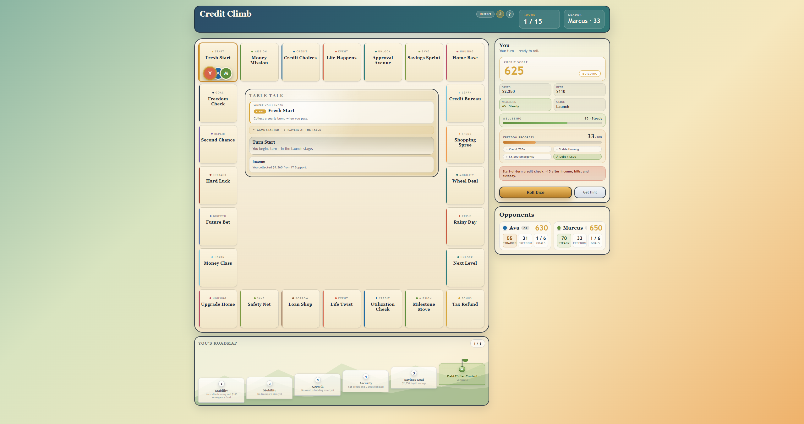

  

  <em>Climb your way to financial freedom.</em>

# Credit Climb

A browser-based multiplayer board game teaching credit scores, debt management, and the slow climb to financial stability. Built as an individual project for ED 315 — Gamifying Learning at Boston University Wheelock.

🎮 Play live: **https://credit-climb-live.onrender.com/**

## What it teaches

Players roll dice, manage income against bills, and decide between socially tempting and financially prudent choices (housing, transportation, loans, savings, the Thursday-night dinner) while racing toward Financial Freedom. The game embeds real consumer-finance mechanics — utilization rates, late payments, credit-tier pricing, predatory lending traps — into a 15-round turn-based competition.

## Design philosophy

The course brief asked for a learning experience that felt like a game rather than a worksheet pretending to be one. Credit Climb leans into three load-bearing rules:

- **The Dilemma Rule.** Every choice is a trade-off. The fun option usually costs you Cash or Credit; the boring option usually costs you Wellbeing. There is no obviously-correct answer — only what you're willing to give up.
- **Asymmetric reality math.** Responsible actions earn +2 to +5 credit points. One missed payment costs −30 to −60. Building is slow. Breaking is fast.
- **Profile inequality.** The five starting profiles — Strong Family Support, No Financial Safety Net, Scholarship Student, Medical Expense Burden, Community Mentor Network — set deliberately unequal starting cash, debt, and wellbeing. They are not difficulty settings; they are different starting points in the same system.

A short three-card onboarding overlay fires on first run to explain these rules in-context. The `?` button in the top-right reopens it any time.

## Run It Locally

1. Open a terminal in this folder.
2. Run `npm install`.
3. Run `npm start`.
4. Open one of the printed URLs in your browser.

The live server prints both a localhost URL and any available LAN URLs, so people on the same Wi-Fi network can join the same room without any extra setup.

## Live Multiplayer

1. The host opens the app and clicks `Create Room`.
2. Everyone else opens the same app URL, enters the room code, and clicks `Join Room`.
3. The host clicks `Start Live Game`.
4. Each player takes their own turn from their own browser.

The host is the authoritative session owner, so if a player disconnects the host can still keep the game moving.

## Deploy For A Public Link

Live multiplayer needs a Node host that supports WebSockets. GitHub Pages alone is not enough for live rooms.

### Render

This folder includes `render.yaml`, so Render can deploy it as a web service.

1. Push this folder to a GitHub repository.
2. Create a new Render web service from that repo.
3. Let Render use the included `render.yaml`, or set:
   - Build command: `npm install`
   - Start command: `npm start`
4. After deploy, share the Render URL and let players create/join rooms there.

### Other Node Hosts

Railway, Fly.io, and similar Node-friendly hosts should also work as long as they support WebSockets and run `npm start`.

### Static Preview

The existing `.github/workflows/deploy-pages.yml` workflow can still publish a static browser copy for solo or hot-seat play, but that static deployment will not support live rooms.

## How To Play

- Enter your name and pick a Profile.
- Use `Create Room` or `Join Room` for live multiplayer, or stay in local mode for hot-seat play.
- Choose how many AI rivals you want.
- Click `Start Live Game` or `Deal the Board`.
- On your turn, click `Roll Dice`.
- Land on spaces to make decisions about credit, housing, transportation, savings, loans, growth, and life events.
- Reach Financial Freedom before the other players, or hold the highest Freedom Progress score when the 15-round turn cap hits.

The center of the board is the shared Table Talk feed — every roll, decision, and consequence is logged there so everyone can follow what happens at the table, not just what happens to them.

## Win Conditions

The game ends one of two ways, whichever comes first.

**Financial Freedom Victory.** A player simultaneously holds:

- Credit Score 720 or higher
- Stable Housing milestone completed
- Emergency Fund of $1,500 or more
- Total Debt at or below $500 (or below 25% of starting debt, whichever is lower — this clause keeps the harder-starting profiles winnable)

**Turn Cap.** After 15 rounds, the game ends and the winner is decided by a composite **Freedom Progress** score — Credit Score 40%, Net Worth 30%, Milestones Completed 20%, Emergency Fund 10%. This score is shown every turn, so players know where they stand at all times. Most playtest games will end this way, and the composite ending is treated as a first-class ending, not a consolation.

## Design Notes

- Each turn covers income, recurring bill payments, credit updates from utilization and missed marks, and a dice roll.
- Credit operates as a tier system that prices access, not just gates it. A Fair-credit player can still rent and finance a phone, but pays more for each — bad credit is a tax, not a door.
- Wellbeing is its own stat. Choices that protect finances often cost Wellbeing; choices that hurt finances often raise it. This is what gives the Dilemma Rule its emotional weight.
- Profile-specific prompt variants change the wording (and sometimes the available options) of certain decisions based on which profile is playing — same prompt, different meaning. A small badge in the prompt modal signals when this is happening.

## Course Context

Built solo for **ED 315 — Gamifying Learning** at **Boston University Wheelock College of Education and Human Development**, Spring 2026, taught by Dr. Greg Benoit. AI-assisted development was explicitly part of the course brief.
